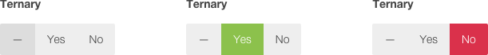

# Ternary Field for [Cockpit](https://github.com/aheinze/cockpit/tree/next)

Ternary switch, similar to boolean, with extra null value



## Installation

```
$ cd cockpit/modules/addons
$ git clone git@github.com:attitude/field-ternary.git
```
_Note: Directory must be named **field-ternary** for Cockpit to register addon._

## Options

| Paramenter | Type            | Description
|:-----------|-----------------|------------
| labelNull  | *string*        | `null` label
| labelTrue  | *string*        | `true` label
| labelFalse | *string*        | `false` label

Feel free to test it and let me know [@martin_adamko](https://twitter.com/martin_adamko) how works for you. Feel free to open issue if you find one.

Enjoy!
